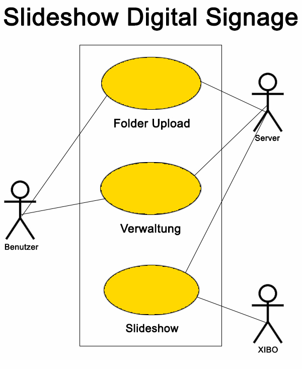
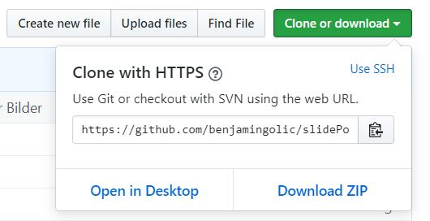

# SlidePoint

Maria Milic, Benjamin Golic und Nina Holzinger
## Aufgabenstellung

Ziel ist es ein Projekt zu erstellen, welches das Anzeigen von Bildern am Digital Signage einfacher gestaltet, da es zurzeit sehr zeitaufwendig und umständlich ist. Der Benutzer soll selbst entscheiden können mit welcher Geschwindigkeit und in welchem Größenformat die Bilder angezeigt werden sollen.

Systemarchitektur

UseCase-Diagramm

 

# Anweisungen

1. Als erstes kopiert man den Link von unserer Repo und clonet die Repo mit:
   #### git clone link
   

2. Dann geht man in den Ordner slidePoint/upload_docker rein.
    #### cd slidePoint/upload_docker/

3. Dann muss Docker gestartet werden. In unserem Fall haben wir Docker auf unserer VMware, also müssen wir mit Hilfe von FileZilla oder WinSCP auf unsere VMware zugreifen und den Ordner upload_docker dort hochladen.
   
4. Wenn man Docker gestartet hat bzw. VMware laufen hat und in dem Ordner drinnen ist, startet man docker-compose mit:
    #### docker-compose up -d

5. Wenn das auch fertig ist geht man in einen beliebigen Browser und gibt ein:
   #### ip-adresse:port
   ip-adresse: kann man mit Hilfe von ifconfig herausfinden 
   port: 8090 
   