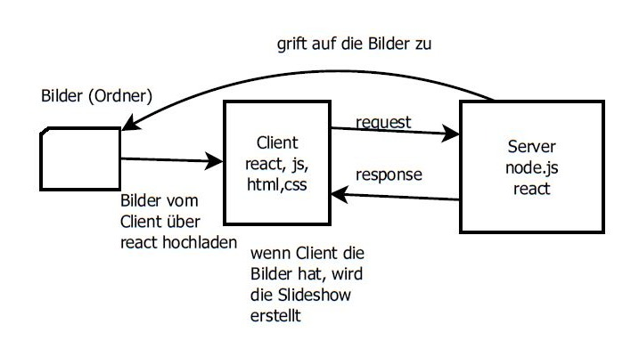
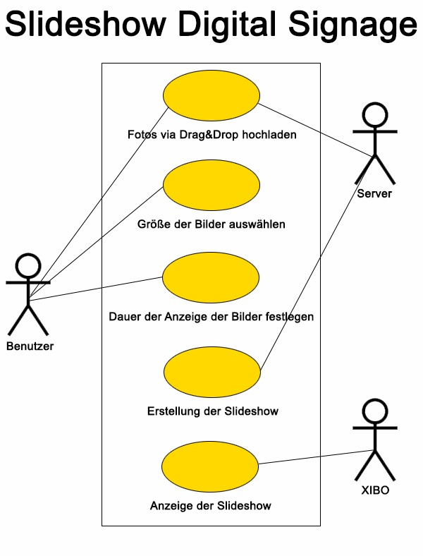

# SlidePoint

Maria Milic, Benjamin Golic und Nina Holzinger
## Aufgabenstellung

Ziel ist es ein Projekt zu erstellen, welches das Anzeigen von Bildern am Digital Signage einfacher gestaltet, da es zurzeit sehr zeitaufwendig und umständlich ist. Der Benutzer soll selbst entscheiden können mit welcher Geschwindigkeit und in welchem Größenformat die Bilder angezeigt werden sollen.

Systemarchitektur

UseCase-Diagramm
